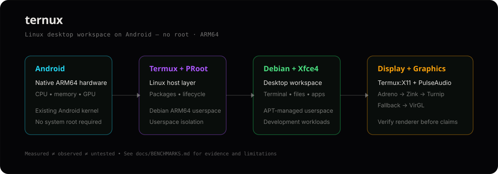
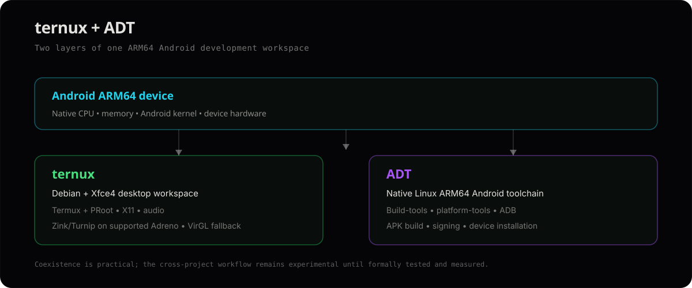

<div align="center">

# ternux

### Debian + Xfce4 on Android — no root, ARM64, verified graphics paths

[](https://github.com/soobujmiah/ternux/releases)
[](https://github.com/soobujmiah/ternux)
[](LICENSE)

[Documentation](docs/README.md) · [Quick start](docs/QUICK-START.md) · [Manual install](docs/MANUAL.md) · [Benchmarks](docs/BENCHMARKS.md) · [Troubleshooting](docs/TROUBLESHOOTING.md) · [CLI](docs/CLI.md) · [বাংলা](bn/README.md)

</div>

---

**ternux** turns an ARM64 Android phone into a Debian + Xfce4 Linux workspace through Termux and PRoot. It provides Termux:X11 display, PulseAudio, a permanent `ternux` control CLI, and a graphics route using **Zink → Turnip** on supported Adreno devices or **VirGL** as a fallback.

**No Android root is required.** Debian uses the existing Android kernel; PRoot provides the userspace environment. This is a Linux desktop/workspace on Android, not a second kernel or conventional VM.



## Install

### 1. Install the Android apps

Install **Termux** and **Termux:X11** first. Use a consistent trusted source for Termux and its plugins. The detailed source/version guidance is in [Quick start](docs/QUICK-START.md).

### 2. Automatic install — fastest

Run inside Termux:

```bash
curl -fsSL https://soobujmiah.github.io/ternux/install.sh | bash
```

If `curl` is unavailable or broken after a partial upgrade:

```bash
wget -qO- https://soobujmiah.github.io/ternux/install.sh | bash
```

The default is unattended: Debian user `ternux`, locale `en_US.UTF-8`, and automatic backend selection. The installer checks the device, installs the host and Debian components, configures graphics/audio, creates the launcher and verifies the result.

### 3. Review before running

The one-line command executes the current remote version. For a complete review, clone the repository so the entry script **and every sourced module** are visible:

```bash
pkg update -y && pkg install git -y
git clone https://github.com/soobujmiah/ternux.git
cd ternux
git log -1 --oneline
(set -e; for f in install.sh uninstall.sh bin/ternux bin/ternux-guest lib/*.sh; do bash -n "$f"; done)
less install.sh bin/ternux bin/ternux-guest lib/*.sh
bash install.sh
```

To pin an exact release first:

```bash
git fetch --tags
git checkout <release-tag>
git status --short
(set -e; for f in install.sh uninstall.sh bin/ternux bin/ternux-guest lib/*.sh; do bash -n "$f"; done)
bash install.sh
```

### Installer options

```bash
bash install.sh --backend zink --user myuser --locale en_US.UTF-8
bash install.sh --with-dev --with-llm --with-blender
bash install.sh --with-network
bash install.sh --with-media
bash install.sh --all
bash install.sh --resume
```

Supported flags also include `--backend auto|zink|virgl`, `--user`, `--locale`, `--zsh`, `--with-dev`, `--with-llm`, `--with-network`, `--with-media`, `--with-blender`, `--all`, `--resume`, `--ui auto|dashboard|plain|off`, `--plain` and `--no-anim`.

**Full installer behavior, phases, profiles, UI, resume, update and removal:** [Installation](docs/INSTALLATION.md).

---

## Manual installation

For people who want every step under their own control:

```bash
# Termux
termux-setup-storage
pkg update -y && pkg upgrade -y
pkg install x11-repo tur-repo -y
pkg install termux-x11-nightly pulseaudio proot-distro virglrenderer-android \
  zsh git curl wget nano tar termux-api -y
pkg install mesa-vulkan-icd-freedreno -y   # Adreno/Zink; skip when unavailable
proot-distro install debian

# Debian
proot-distro login debian --shared-tmp
apt update
DEBIAN_FRONTEND=noninteractive apt install -y \
  sudo nano dbus-x11 pulseaudio pulseaudio-utils x11-utils mesa-utils \
  libgl1-mesa-dri libvulkan1 vulkan-tools xfce4 xfce4-terminal \
  vlc colord polkitd locales zip unzip xarchiver unrar-free 7zip

adduser ternux
for group in sudo video render audio; do
  getent group "$group" >/dev/null && usermod -aG "$group" ternux
done
printf '%s\n' 'ternux ALL=(ALL) NOPASSWD: ALL' > /etc/sudoers.d/ternux
chmod 0440 /etc/sudoers.d/ternux
visudo -cf /etc/sudoers.d/ternux
exit
```

Then follow the maintained guide for the **complete Zink/Turnip or VirGL setup, audio bridge, locale/fonts, launcher, validation and all remaining commands**:

**[→ Full Manual Installation](docs/MANUAL.md)**

---

## First launch & verification

```bash
source ~/.bashrc
x
```

Or:

```bash
xgo
```

Open the Termux:X11 app, then verify the actual renderer:

```bash
glxinfo -B
vulkaninfo --summary
pactl info
```

Expected graphics examples:

```text
OpenGL renderer string: zink ... Adreno ... MESA_TURNIP
```

or:

```text
virgl / virpipe
```

`llvmpipe` means CPU software rendering. Diagnose that before benchmarking: [Troubleshooting](docs/TROUBLESHOOTING.md).

Daily shortcuts:

```text
x       start desktop
xgo     open Termux:X11 and start desktop
killx   stop display/audio and clean stale session files
db      Debian shell as regular user
droot   Debian shell as root
```

CLI:

```bash
ternux start
ternux stop
ternux restart
ternux verify
ternux doctor
ternux repair
ternux info
ternux logs
```

The Debian guest companion exposes guest-local commands and rejects host lifecycle commands that could create a nested PRoot session. See [CLI reference](docs/CLI.md).

---

## What is inside?

| Layer | Role |
|---|---|
| Termux + PRoot | Android host and Debian userspace |
| Debian ARM64 | GNU/Linux base |
| Xfce4 + Termux:X11 | Desktop and display |
| PulseAudio | Android audio bridge |
| Zink → Turnip → KGSL | Adreno OpenGL/Vulkan graphics route |
| VirGL | Compatibility graphics route |
| `ternux` CLI + `~/x.sh` | Lifecycle, diagnostics, repair and benchmarks |

Base applications include Xfce Terminal, VLC, archive tools, Mesa utilities and Vulkan tools. Development, LLM, media, network and Blender workloads are opt-in.

For the complete architecture/data paths and package behavior, see [Architecture](docs/ARCHITECTURE.md) and [Installation](docs/INSTALLATION.md).

---

## Ternux + ADT

Ternux is the **Linux desktop/workspace layer**. [ADT](https://github.com/soobujmiah/adt) is the **Android build/toolchain layer**: Linux ARM64 build-tools, platform-tools, ADB, APK signing and device installation.



They can coexist on the same Termux + PRoot Debian foundation, but the cross-project workflow remains **experimental until formally tested and measured**.

---

## Requirements

- ARM64 / aarch64 Android device
- ternux baseline: Android 10+
- 4 GB RAM minimum; 6–8 GB recommended for desktop + development/small local models
- About 3–4 GB for base; roughly 10–12 GB with `--all`, plus working space
- No root required
- Stable network during installation
- Accessible `/dev/kgsl-3d0` on supported Adreno devices for the intended Zink/Turnip route

---

## Evidence

The published August 2026 evidence snapshot is from a **Redmi Turbo 4 Pro / Snapdragon 8s Gen 4 / Adreno 825**. The observed renderer was:

```text
zink Vulkan 1.4(Adreno (TM) 825 (MESA_TURNIP))
```

Supplied results include:

- `glmark2`: **140** aggregate score; reported scene range **45–164 FPS**
- `glmark2-es2 --off-screen`: **364** aggregate score; reported scene range **53–465 FPS**, with a recorded DRI3 warning
- Blender 4.3.2: Zink/Turnip OpenGL viewport path observed; Cycles GPU rendering not established
- llama.cpp and stable-diffusion.cpp: Vulkan build paths reported; numeric runtime performance not established

These are device-specific evidence, not universal performance guarantees. The two glmark2 modes must not be compared as a speed ratio. Full scene values, methodology, caveats, and outstanding measurements are in [Benchmarks](docs/BENCHMARKS.md).

---

## Limits & safety

- PRoot is not a VM and Debian shares Android's kernel.
- Guest root is not Android root; kernel modules, real systemd boot and unrestricted hardware access remain unavailable.
- GPU support varies by device; VirGL is a fallback, not an equal-performance guarantee.
- An OpenGL renderer does not prove Blender Cycles, llama.cpp or diffusion GPU offload.
- Sustained builds/inference/rendering can cause heat, throttling, battery drain or Android process management.
- Back up important data before destructive work: `proot-distro backup debian --output ~/debian.tar.gz`.
- Keep local development/AI services on `127.0.0.1` unless deliberate authenticated exposure is configured.

More detailed safety, graphics, storage, heat and troubleshooting guidance remains in [FAQ](docs/FAQ.md), [Configuration](docs/CONFIGURATION.md), [Architecture](docs/ARCHITECTURE.md) and [Troubleshooting](docs/TROUBLESHOOTING.md).

---

## Uninstall

```bash
ternux uninstall
```

Or from a clone:

```bash
bash uninstall.sh
```

Back up Debian first. The documented `all` removal targets the ternux session/container, launcher/aliases and ternux state/logs; unrelated Termux packages, repository/storage choices and the Termux PulseAudio configuration are deliberately left in place. See the [Installation guide](docs/INSTALLATION.md) and `uninstall.sh` for exact behavior/options.

---

## Documentation map

- [Documentation overview](docs/README.md)
- [Quick start](docs/QUICK-START.md)
- [Installation](docs/INSTALLATION.md)
- [Manual installation](docs/MANUAL.md)
- [Usage](docs/USAGE.md)
- [Configuration](docs/CONFIGURATION.md)
- [Troubleshooting](docs/TROUBLESHOOTING.md)
- [Architecture](docs/ARCHITECTURE.md)
- [Benchmarks](docs/BENCHMARKS.md)
- [FAQ](docs/FAQ.md)
- [CLI reference](docs/CLI.md)
- [Contributing](CONTRIBUTING.md)
- [Security](SECURITY.md)

Deep technical references for Termux, Termux:X11, PRoot, Mesa/Zink, glmark2, Blender, llama.cpp and stable-diffusion.cpp are retained in the documentation set and upstream-reference sections there.

---

## License

[Apache-2.0](LICENSE) © 2026 [Sobuj Miah (@soobujmiah)](https://github.com/soobujmiah)
